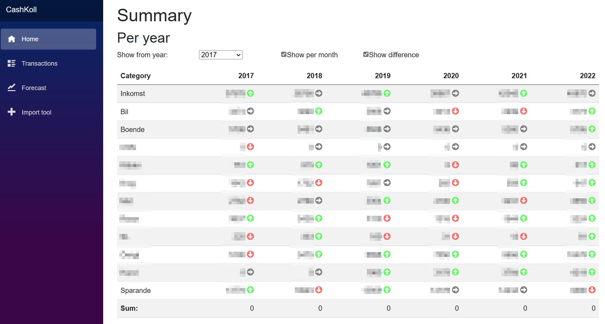

# CashKoll
Personal finance manager created with simplicity and privacy in mind (the data never leaves your computer).

This project started with and Excel sheet I've been using to track my personal finances. Created this port to .Net 7 and Blazor mostly to learn the Blazor UI framework.

## Features
* Show cash spent on different categories of expenses
* Using local SQLite database - your finance data never leaves your computer
* CSV import of data, <a href="https://www.nordea.se/">Nordea</a> CSV format supported by default
* Using Blazor for UI

## Screeshot



## How to run

* Create sqlite database (using for example <a href="https://www.heidisql.com/">HeidiSQL</a>).
* Run scripts in /Db-scripts:
    * V01_create_tables.sql
    * V02_create_category_map.sql
    * V03_trans_deleted_column.sql
* Optionally run S** scripts to create sample data or add your own
* Add database file, expense and savings account id to your appsettings.json

````
  "ExpenseAccountId": 1,
  "SavingsAccountId": 3,
  "ConnectionString": "Data Source=C:\\temp\\CashKoll-Db\\cashkoll.sqlite3"
````

* Build and run the app
````
> dotnet build
> dotnet run
````

Now your browser will start.